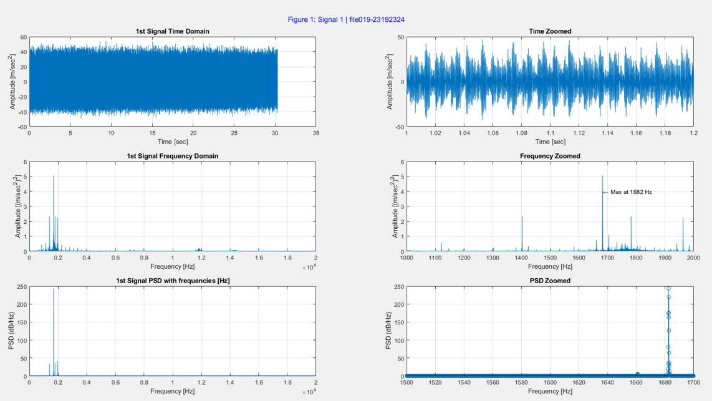
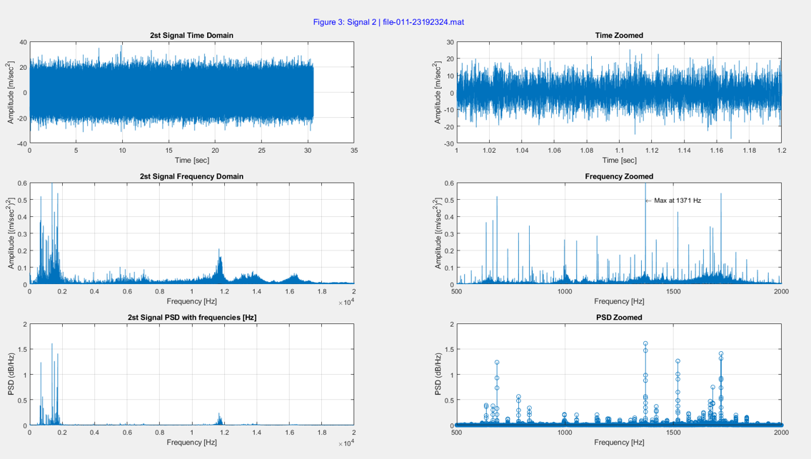
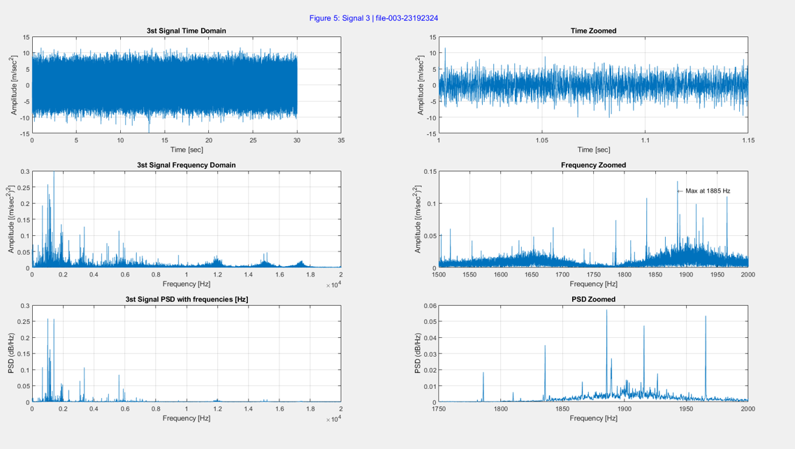
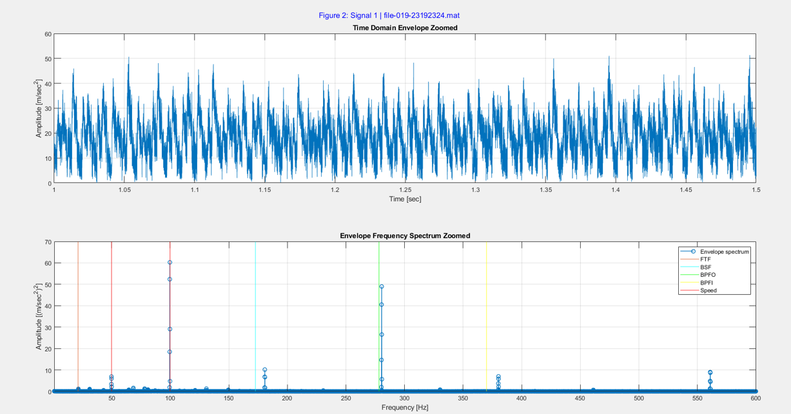
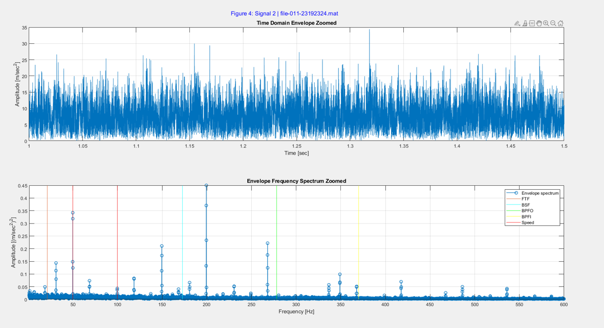
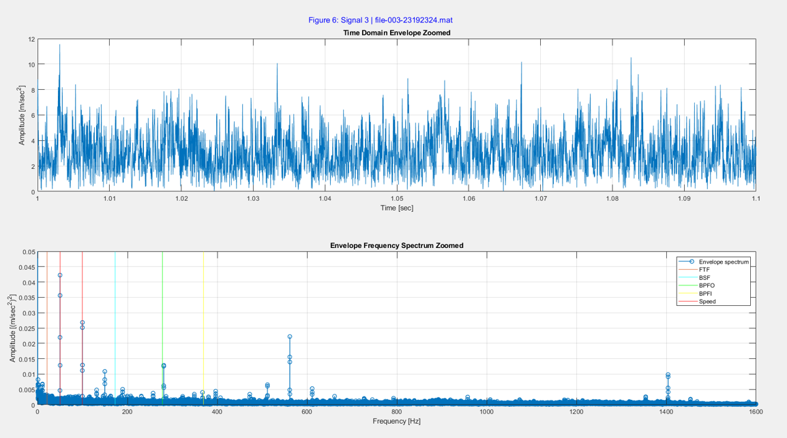

# Damage Detection on Bearings – Condition Monitoring (MATLAB)

This repository contains a **Condition Monitoring** course project focused on  
**damage detection on rolling element bearings** using vibration signal analysis.

The project demonstrates how bearing faults can be identified by combining  
**time-domain**, **frequency-domain**, and **envelope (Hilbert-based)** methods,  
together with classical **statistical indicators**.

---

## Project Overview

Rolling element bearings generate characteristic vibration frequencies when defects
occur on:
- the inner race
- the outer race
- the rolling elements (balls)
- the cage

In this project, vibration measurements are analyzed to:
- extract characteristic fault frequencies
- visualize damage-related spectral peaks
- support fault diagnosis using envelope analysis

The implementation is entirely done in **MATLAB**.

---

## Methods Used

### Time-Domain Analysis
- Raw vibration signal visualization
- Zoomed inspection of impulsive behavior
- First indication of abnormal vibration patterns

### Frequency-Domain Analysis (FFT)
- Fast Fourier Transform of vibration signals
- Identification of dominant frequency components
- Comparison with theoretical bearing fault frequencies

### Envelope Analysis (Hilbert Transform)
- Envelope extraction using the Hilbert transform
- Envelope spectrum for enhanced fault visibility
- Particularly effective for localized bearing defects

### Statistical Indicators
- Mean
- RMS
- Skewness
- Kurtosis

These indicators support the assessment of fault severity.

---

## Bearing Fault Frequencies

The following characteristic frequencies are calculated and evaluated:

- FTF – Fundamental Train Frequency  
- BSF – Ball Spin Frequency  
- BPFO – Ball Pass Frequency Outer Race  
- BPFI – Ball Pass Frequency Inner Race  

The theoretical frequencies are computed using standard bearing geometry formulas
and multiplied by the rotational frequency `fn` to obtain values in Hz.

---

## Repository Structure

.
├── YasinBüyükarslan-1626421.m  
├── hcurve_fun.m  
├── file_003_23192324.mat 
├── file_011_23192324.mat  
├── file_019_23192324.mat 
└── README.md
figures/
├── time_domain.png
├── fft_spectrum.png
├── envelope_signal.png
└── envelope_spectrum.png

---

## File Descriptions

YasinBüyükarslan-1626421.m  
Main MATLAB script that:
- loads vibration measurement data (.mat)
- performs time-domain analysis
- computes FFT spectra
- applies envelope analysis
- extracts statistical indicators
- visualizes all results

hcurve_fun.m  
Helper function for envelope extraction using the Hilbert transform.

Condition Monitoring-YasinBüyükarslan.pptx  
Presentation summarizing methodology, results, and interpretation.

Damage detection on bearings 2024_2025.pdf  
Written report documenting theory, implementation, and conclusions.

---

## Data Format

The main script expects vibration measurement files in MATLAB `.mat` format.

Each file is assumed to contain variables such as:
- fs   : sampling frequency (Hz)
- fn   : rotational frequency (Hz)
- datensatz : vibration signal vector

Example filenames:
file_019_23192324.mat  
file_011_23192324.mat  

---

## Requirements

- MATLAB (recent version recommended)
- Signal Processing Toolbox (required for hilbert function)

---

## How to Run

1. Clone the repository:
git clone <repository-url>
cd <repository-folder>

2. Place the vibration .mat files in the same directory  
   (or update the file paths inside the main script).

3. Run the main script in MATLAB:
run('YasinBüyükarslan-1626421.m')

---

## Output

The following figures illustrate the main results of the bearing condition analysis.

### Time-Domain Signal
Raw vibration signal and zoomed view highlighting impulsive behavior and FFT spectrum used to identify dominant frequency components.

#### Signal 1

#### Signal 2

#### Signal 3

---

### Envelope Signal
Envelope of the vibration signal obtained using the Hilbert transform and Envelope spectrum with marked bearing fault frequencies (FTF, BSF, BPFO, BPFI).

#### Signal 1

#### Signal 2

#### Signal 3

---

### Envelope Spectrum with Fault Frequencies

These outputs allow visual and quantitative assessment of bearing condition.

---

## Academic Context

Course: Condition Monitoring  
Topic: Damage Detection on Bearings  
Focus: Vibration-based fault diagnosis  
Language: MATLAB  

---

## Author

Yasin Büyükarslan

---

## License

Academic project – provided for educational purposes only.  

